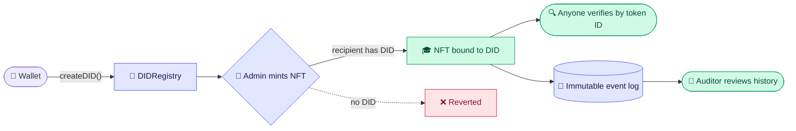
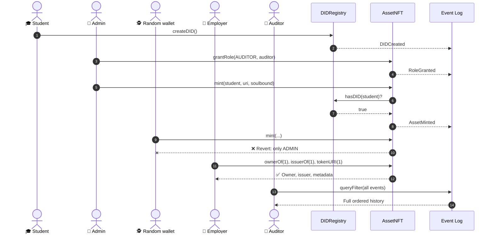
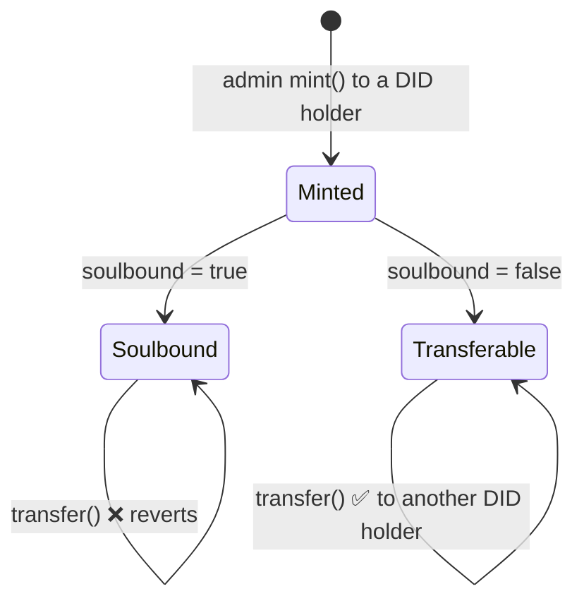
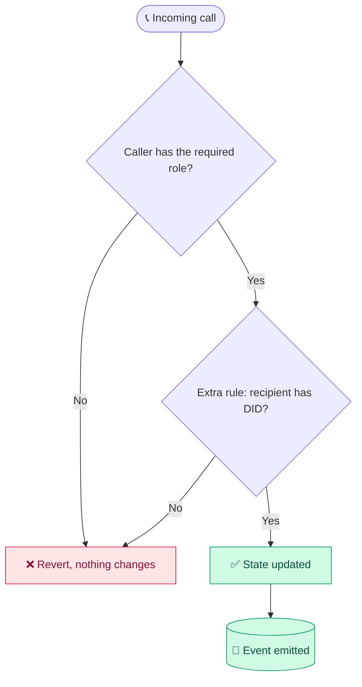
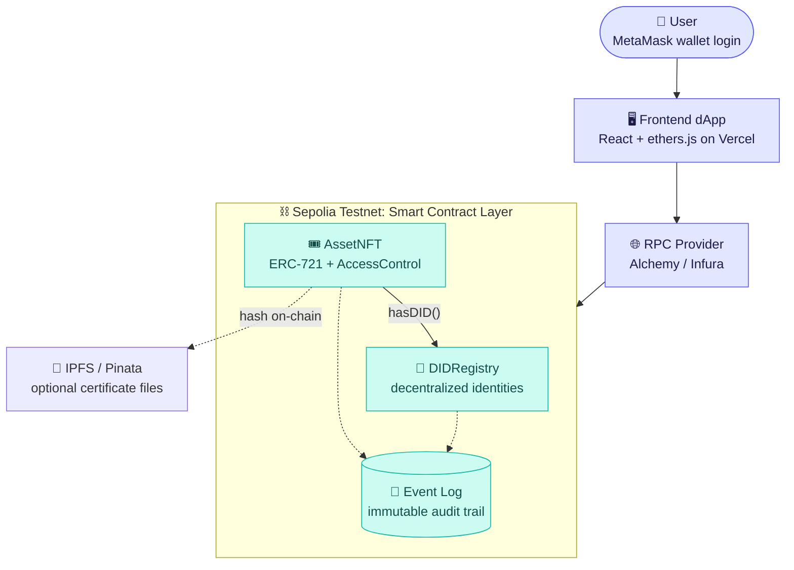
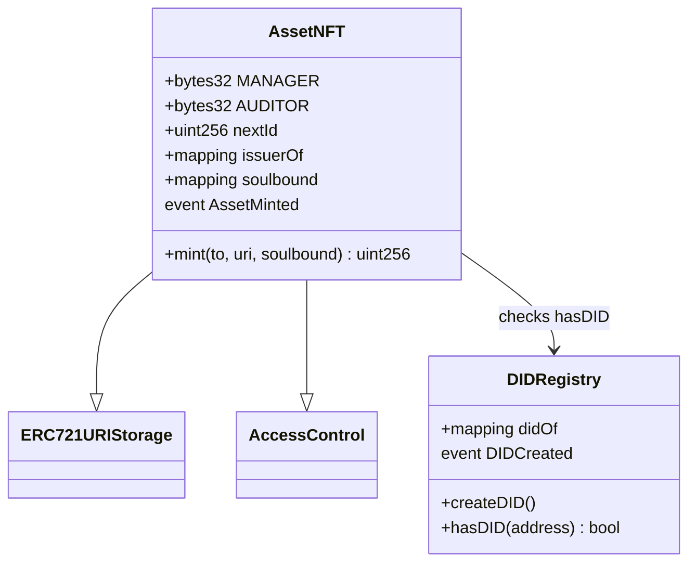
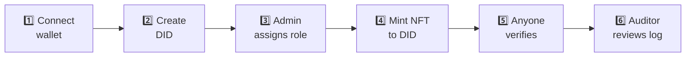

<p align="center">
  
</p>


<div align="center">


<br/>


**One platform where _who you are_, _what you may do_ and _what you own_ are enforced by smart contracts and open to audit.**

[🚀 Live Demo](#-quick-start) · [🎬 Demo Video](#-demo-walkthrough) · [📜 Contracts](#-smart-contracts) · [🗺️ Roadmap](#%EF%B8%8F-roadmap)

</div>

---

## 📑 Table of Contents

1. [The Problem](#-the-problem)
2. [Our Solution](#-our-solution)
3. [Core Features](#-core-features)
4. [How It Works](#-how-it-works)
5. [Role-Based Access Control](#-role-based-access-control)
6. [Architecture](#%EF%B8%8F-architecture)
7. [Smart Contracts](#-smart-contracts)
8. [Tech Stack](#%EF%B8%8F-tech-stack)
9. [Quick Start](#-quick-start)
10. [Demo Walkthrough](#-demo-walkthrough)
11. [Security and Trade-offs](#-security-and-trade-offs)
12. [Use Cases](#-use-cases)
13. [Roadmap](#%EF%B8%8F-roadmap)
14. [Team](#-team)

---

## 🔥 The Problem

Institutions issue credentials, grant permissions and record ownership in **separate, centralized systems**.

| | Pain point | Impact |
|---|---|---|
| 📄 | Forged degrees, licenses and ownership papers | Hard to detect, slow to verify |
| 🗄️ | Central databases are single points of failure | Records can be edited without a trace |
| 🧩 | Identity, permissions and assets are disconnected | Systems that don't trust each other |
| 🔑 | Users don't control their own identity | Platforms hold, lock or leak it |
| 🕵️ | Weak audit trails | Insider tampering is hard to prove |

## 💡 Our Solution

Experium gives every user a **decentralized identifier (DID)**, represents assets as **ERC-721 NFTs** bound to that identity, and governs every action through **role-based smart contracts**.

| ❌ Problem | ✅ Experium response |
|---|---|
| Forged documents | Unique NFTs verifiable by anyone on-chain |
| Slow verification | Instant owner + issuer check using the token ID |
| Central point of failure | Decentralized ledger, no single owner of records |
| Unauthorized actions | Smart-contract RBAC rejects calls outside a role |
| Disputed ownership | One NFT, one owner, full transfer history |
| Weak audit trail | Every action logged as an immutable on-chain event |

---

## ✨ Core Features

<table>
<tr>
<td width="33%" valign="top">

### 🪪 Decentralized Identity
One self-owned `did:ethr` identifier per wallet. No password, no central login server.

`DIDCreated(owner, did, time)`

</td>
<td width="33%" valign="top">

### 🎟️ Controlled NFT Minting
Only an **admin** can mint, and only to a wallet that **already holds a DID**.

`AssetMinted(tokenId, to, issuer, uri)`

</td>
<td width="33%" valign="top">

### 🔒 Soulbound Ownership
Credential NFTs can be **non-transferable**. A degree stays with the person it was issued to.

`Transfer reverts after mint`

</td>
</tr>
<tr>
<td width="33%" valign="top">

### 🛡️ Role-Based Access
Admin, Manager, Auditor and User roles via OpenZeppelin `AccessControl`.

`RoleGranted / RoleRevoked`

</td>
<td width="33%" valign="top">

### 🔍 Instant Public Verification
Enter a token ID and see owner, issuer and metadata. No login, no call to the issuer.

`ownerOf · issuerOf · tokenURI`

</td>
<td width="33%" valign="top">

### 📜 Tamper-Proof Audit Trail
Every action is stored as an on-chain event, in block order, and cannot be edited.

`Audit view reads queryFilter`

</td>
</tr>
</table>

---

## 🔄 How It Works

### The big picture



### The golden path, step by step



### Soulbound token lifecycle



---

## 🛡️ Role-Based Access Control

Every protected function checks the caller's role **inside the contract** before it executes. The UI only hides buttons; it is never the enforcement layer.



| Role | 🪙 Mint NFT | 🔑 Grant roles | 🔍 Verify assets | 📜 View audit log |
|---|:---:|:---:|:---:|:---:|
| 👑 **Admin** | ✅ | ✅ | ✅ | ✅ |
| 🧑‍💼 **Manager** | ❌ | ❌ | ✅ | ✅ |
| 🧾 **Auditor** | ❌ | ❌ | ✅ | ✅ |
| 👤 **User** | ❌ | ❌ | ✅ (any asset) | ❌ |

> **Core rules enforced on-chain:** only an admin can mint · a recipient must hold a DID · every call is role-checked · identity, minting, role changes and transfers are all logged.

---

## 🏗️ Architecture

> **No custom backend.** The blockchain is the database, MetaMask is the authentication layer, and on-chain events are the audit log.



---

## 📜 Smart Contracts

Source: [`contracts/Experium.sol`](contracts/Experium.sol)



| Function | Who can call | Reverts when |
|---|---|---|
| `createDID()` | Any wallet | The wallet already has a DID |
| `mint(to, uri, soulbound)` | Admin only | Caller is not admin · recipient has no DID |
| `transfer*` | Token owner | Token is soulbound |
| `grantRole / revokeRole` | Admin only | Caller is not admin |
| `ownerOf · issuerOf · tokenURI` | Anyone | Token does not exist |

---

## 🛠️ Tech Stack

| Layer | Technology |
|---|---|
| ⛓️ Smart contracts |   |
| 🧪 Dev and network |    |
| 🖥️ Frontend |    |
| 👛 Wallet and RPC |   |
| 📁 Storage (optional) |  Pinata |
| 🚀 Hosting |   |

---

## 🚀 Quick Start

### ▶️ Run the demo (no wallet needed)

The MVP front-end runs the full Experium flow on a **simulated in-browser chain** that mirrors the contract rules, so it works instantly for demos.

```bash
git clone https://github.com/<your-username>/experium.git
cd experium
# just open index.html in your browser, or serve it:
npx serve .
```

🔗 **Live demo:** `[Vercel link]`  ·  🎬 **Backup video:** `[video link]`

### ⛓️ Deploy the contracts to Sepolia

1. Open [Remix](https://remix.ethereum.org) and paste `contracts/Experium.sol`.
2. Compile with Solidity `0.8.20` or newer.
3. Connect MetaMask to **Sepolia** (get test ETH from a faucet).
4. Deploy `DIDRegistry`.
5. Deploy `AssetNFT`, passing the `DIDRegistry` address to the constructor.
6. Save both addresses here:

| Contract | Address |
|---|---|
| DIDRegistry | `[explorer link]` |
| AssetNFT | `[explorer link]` |

---

## 🎬 Demo Walkthrough

A three-minute walkthrough using three pre-funded wallets: **Admin**, **Student** and **Auditor**.



| Step | Actor | Action and result |
|:---:|---|---|
| 1 | 🎓 Student | Connects wallet and creates a DID; identity appears on screen |
| 2 | 👑 Admin | Grants Manager and Auditor roles; `RoleGranted` event logged |
| 3 | 👑 Admin | Mints a degree NFT to the student's DID |
| 4 | 🕵️ Random wallet | Tries to mint and is **rejected**: only admins can issue |
| 5 | 💼 Employer | Enters the token ID and sees owner, issuer and metadata instantly |
| 6 | 🧾 Auditor | Opens the audit view and sees every action in order |

> ✅ **Success criteria:** a new user can create a DID, receive an NFT from an admin and have it verified by a third party in seconds. Any unauthorized attempt is rejected on-chain and visible in the audit log.

---

## 🔐 Security and Trade-offs

| Concern | Approach |
|---|---|
| 🛡️ Enforcement | Permissions are checked inside the contract; the UI only hides buttons |
| 🕶️ Privacy | Sensitive files stay off-chain (IPFS); only hashes are stored on-chain |
| 🔑 Key loss | Social recovery planned as a post-MVP milestone |
| 💸 Cost | Testnet for the MVP; Layer-2 or permissioned chain for production |

> ⚠️ **MVP note:** this is a hackathon prototype. The contracts have not been professionally audited and should not be used with real assets.

---

## 🌍 Use Cases

| | Domain | Example |
|---|---|---|
| 🎓 | **Education** | Degree and certificate verification |
| 🏠 | **Land and property** | Records and duplicate-sale prevention |
| 🏥 | **Healthcare** | Patient-owned records shared by permission |
| 🏛️ | **Government** | Licenses and permits |
| 📦 | **Supply chain** | Product authenticity and traceability |

The same core engine powers all of them; only the NFT metadata changes.

### Who benefits

| Stakeholder | Benefit |
|---|---|
| 🏫 Institutions | Lower fraud and verification workload; one trusted record of issuance |
| 👤 Individuals | Own and prove identity and credentials without a middleman |
| 💼 Employers / verifiers | Instant, independent trust with no call to the issuer |
| 🧾 Regulators / auditors | Ready-made, tamper-proof audit trail |

---

## 🗺️ Roadmap

- [x] DIDRegistry and AssetNFT with OpenZeppelin
- [x] Role-based access control (Admin, Manager, Auditor, User)
- [x] Soulbound credential NFTs
- [x] Interactive demo front-end (simulated chain)
- [x] Audit log view
- [ ] Live Sepolia mode with MetaMask + ethers.js
- [ ] Hardhat test suite and deployment scripts
- [ ] IPFS / Pinata storage for certificate files
- [ ] Shareable verification links and QR codes
- [ ] Social recovery for lost keys
- [ ] Layer-2 or permissioned-chain deployment

---

## 📂 Project Structure

```
experium/
├── assets/
│   └── banner.svg
├── contracts/
│   └── Experium.sol      # DIDRegistry + AssetNFT
├── index.html            # Demo front-end
└── README.md
```

---


---

<div align="center">

**Experium** · Making identity, access and ownership verifiable for everyone.

⭐ If you like this project, give it a star!

</div>
